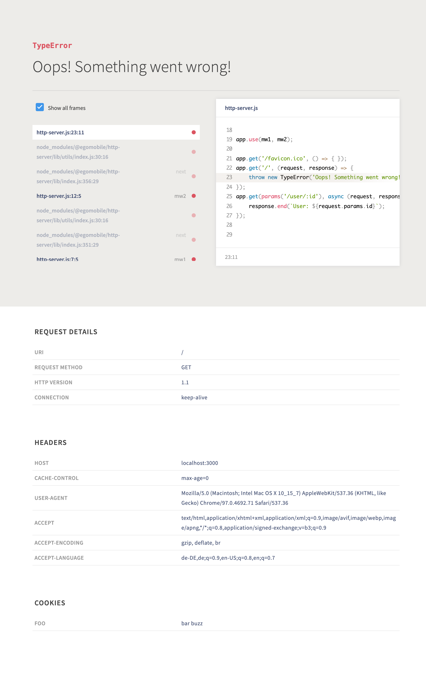

[](https://www.npmjs.com/package/@egomobile/http-server) [](https://github.com/egomobile/node-http-server/actions?query=workflow%3APublish) [](https://github.com/egomobile/node-http-server/pulls)

# @egomobile/http-server

> Very fast alternative HTTP server to [Express](http://expressjs.com/), with simple routing and middleware support and which ist compatible with [Node.js 12](https://nodejs.org/en/blog/release/v12.0.0/) or later.

## Install

Execute the following command from your project folder, where your `package.json` file is stored:

```bash
npm install --save @egomobile/http-server
```

## Usage

### Quick example

```typescript
import createServer, { buffer, params, query } from "@egomobile/http-server";

async function main() {
  const app = createServer();

  // POST request for / route
  // that uses the middleware buffer(), which loads the
  // whole request body with a limit of 128 MB by default
  // and writes the data to 'body' prop of 'request' object
  // as Buffer
  app.post("/", [buffer()], async (request, response) => {
    const name: string = request.body!.toString("utf8");

    response.write("Hello: " + name);
    // no response.end() is required here
  });

  // parameters require a special path validator here
  // s. https://github.com/lukeed/regexparam
  // for more information about the string format
  app.get(params("/foo/:bar/baz"), async (request, response) => {
    response.write("BAR: " + request.params!.bar);
  });

  // parse query parameters from URL
  // and write them to 'query' prop of 'request' object
  app.get("/foo", [query()] async (request, response) => {
    response.write(" BAR: " + request.query!.bar);
    response.write(" BAZ: " + request.query!.baz);
  });

  await app.listen();
  console.log(`Server now running on port ${app.port} ...`);
}

main().catch(console.error);
```

### Middlewares

#### buffer()

```typescript
import createServer, { buffer } from "@egomobile/http-server";

async function main() {
  // ...

  // loads the whole request and writes it
  // to 'body' prop of 'request' object
  // with a custom limit of 256 MB
  app.put("/", [buffer(256)], async (request, response) => {
    response.write("Hello: " + request.body!.toString("ascii"));
  });

  // ...
}

main().catch(console.error);
```

#### json()

```typescript
import createServer, { json } from "@egomobile/http-server";

async function main() {
  // ...

  // loads the whole request, parses the content as UTF-8 JSON
  // string and writes it to 'body' prop of 'request' object
  // with a default limit of 128 MB
  app.put("/", [json()], async (request, response) => {
    response.write("Hello: " + JSON.stringify(request.body, null, 2));
  });

  // ...
}

main().catch(console.error);
```

#### validate

```typescript
import createServer, { json, schema, validate } from "@egomobile/http-server";

interface IMySchema {
  email: string;
  name?: string;
}

// s. https://joi.dev/ for more information
const mySchema = schema.object({
  email: schema.string().strict().trim().email().required(),
  name: schema.string().strict().trim().min(1).optional(),
});

async function main() {
  // ...

  // loads the whole request, parses the content as UTF-8 JSON
  // string and writes it to 'body' prop of 'request' object
  // with a default limit of 128 MB
  app.patch("/", [json(), validate(mySchema)], async (request, response) => {
    const body: IMySchema = request.body;

    // TODO: your code
  });

  // ...
}

main().catch(console.error);
```

#### cookies

```typescript
import createServer, { cookies } from "@egomobile/http-server";

async function main() {
  // ...

  // parses the content of 'Cookie' HTTP header
  // and makes it available as key/value pairs
  // in 'cookies' property of 'request' object
  app.delete("/", [cookies()], async (request, response) => {
    response.write(" FOO: " + request.cookies!.foo);
    response.write(" BAZ: " + request.cookies!.baz);
  });

  // ...
}

main().catch(console.error);
```

#### lang

```typescript
import createServer, { lang } from "@egomobile/http-server";

async function main() {
  // ...

  // parses the content of 'Accept-Language' HTTP header
  // and makes the best matching, supported language available
  // in 'lang' property of 'request' object
  app.get("/docs", [lang("de", "en")], async (request, response) => {
    response.write("lang: " + request.lang);
  });

  // ...
}

main().catch(console.error);
```

#### 3rd party modules

```typescript
import cors from "cors"; // npm i cors && npm i -D @types/cors
import createServer from "@egomobile/http-server";

async function main() {
  // ...

  app.use(cors());

  app.get("/", async (request, response) => {
    // your code
  });

  // ...
}

main().catch(console.error);
```

#### Custom middlewares

```typescript
import createServer from "@egomobile/http-server";

async function main() {
  // ...

  // global middlewares
  app.use(
    async (request: any, response, next) => {
      request.foo = "1";
      next();
    },
    async (request: any, response, next) => {
      request.foo += "a";
      next();
    }
  );

  app.patch(
    "/",
    // route specific middlewares
    [
      async (request: any, response, next) => {
        request.foo += 2;
        next();
      },
      async (request: any, response, next) => {
        request.foo += 3;
        next();
      },
    ],
    async (request: any, response) => {
      // request.foo === '1a23'
    }
  );

  // ...
}

main().catch(console.error);
```

## Error handling

```typescript
import createServer from "@egomobile/http-server";

async function main() {
  // ...

  // custom error handler
  app.setErrorHandler(async (error, request, response) => {
    const errorMessage = Buffer.from("SERVER ERROR: " + String(error), "utf8");

    if (!response.headersSend) {
      response.writeHead(400, {
        "Content-Length": String(errorMessage.length),
      });
    }

    response.write(errorMessage);
    response.end();
  });

  // custom 404 handler
  app.setNotFoundHandler(async (request, response) => {
    const notFoundMessage = Buffer.from(`${request.url} not found!`, "utf8");

    if (!response.headersSend) {
      response.writeHead(404, {
        "Content-Length": String(notFoundMessage.length),
      });
    }

    response.write(notFoundMessage);
    response.end();
  });

  app.get("/", async (request, response) => {
    throw new Error("Something went wrong!");
  });

  // ...
}

main().catch(console.error);
```

### Pretty error pages

```typescript
import createServer, { prettyErrors } from "@egomobile/http-server";

async function main() {
  // ...

  // custom error handler
  app.setErrorHandler(prettyErrors());

  app.get("/", async (request, response) => {
    throw new Error("Something went wrong!");
  });

  // ...
}

main().catch(console.error);
```

A possible result could be:

<kbd></kbd>

## Credits

The module makes use of:

- [joi](https://joi.dev/) by [Sideway Inc.](https://github.com/sideway)
- [regexparam](https://github.com/lukeed/regexparam) by [Luke Edwards](https://github.com/lukeed)
- [Youch!](https://github.com/poppinss/youch) by [Poppinss](https://github.com/poppinss)

## Documentation

The API documentation can be found [here](https://egomobile.github.io/node-http-server/).
